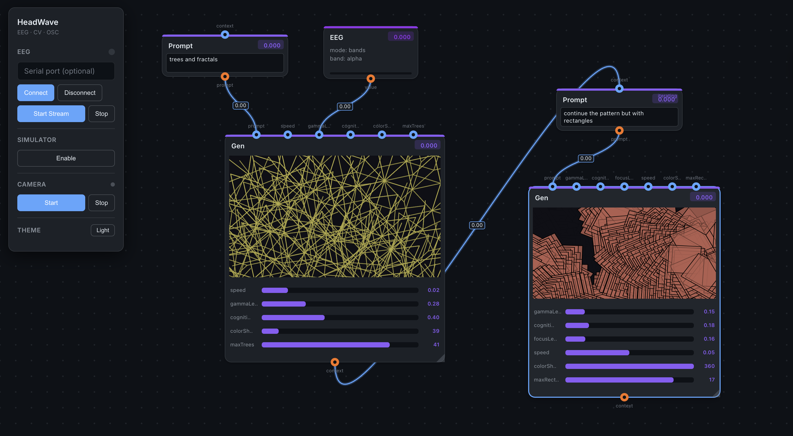

# HeadWave



A visual programming environment for creating generative art controlled by biosignals (EEG), computer vision (face/hand tracking), and AI-powered code generation.

## Features

- **Gen nodes** - AI-generated p5.js visuals from text prompts
- **Prompt nodes** - Describe what you want to create
- **Parameters** - Real-time control via sliders
- **Modulators** - Connect EEG, face tracking, hand tracking, or LFOs to parameters
- **Iteration** - Chain generations to refine and evolve visuals

## Install

```bash
./setup.sh
```

## Run

```bash
./run.sh
```

Open http://localhost:8000

## Acknowledgments

Inspired by [Spellburst](https://spellburst.github.io/) by Miroslav Suzara et al. - a node-based interface for exploratory creative coding with LLMs.
